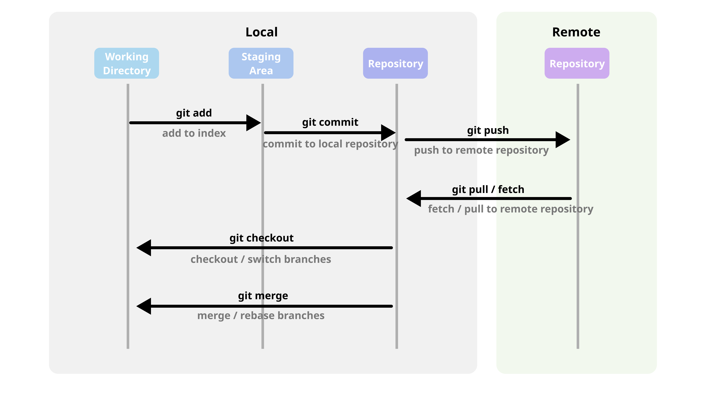

# Git 작업 영역

Git은 내부적으로 3가지 종류의 작업 영역으로 구분하여 동작한다.

 - Working Directory(작업 공간)
 - Staging Area(임시 작업 공간)
 - Repository(저장소)

<div align="center">
    
</div>
<br/>

## Working Directory

사용자가 직접 코드를 편집하는 실제 파일들이 있는 로컬 디렉토리이다. 여기에 변경 사항이 발생하면, Git은 이 변경 사항을 추적하기 위해 이를 인식한다.

 - .git 폴더가 존재하는 루트 디렉토리를 의미한다.
 - 프로젝트 단위로 Git 저장소를 만든다면, 해당 프로젝트 루트 디렉토리부터 작업 영역이 된다.

## Staging Area

작업 영역에서 수정된 파일들을 "커밋할 준비" 상태로 두는 임시 공간이다. 사용자가 git add 명령어를 사용해 수정된 파일을 스테이징 영역에 추가할 수 있다. 스테이징 영역에 있는 파일은 다음 커밋에 포함될 예정이 된다.
 - git add 명령어 수행시 Working Directory에 있는 Untracked(추적되지 않음), Modified(수정됨) 파일들이 Staged(스테이징됨) 상태가 된다.
 - Staged(스테이징됨) 상태의 파일은 git commit 명령어 수행시 변경 이력에 추가된다.

## Local Repository

git commit 명령어를 사용해 스테이징 영역의 변경 사항을 로컬 저장소에 영구적으로 기록하게 된다. 이떄, 커밋된 변경 사항들은 Git의 히스토리에 남게 되어 변경 이력을 추적할 수 있다.
 - Working Directory의 변경 이력들이 저장되어 있는 영역
 - .git 디렉토리를 Repository로 볼 수 있다.

## 작업 영역 명령어 및 예시

 - 작업 영역에 대한 명령어
    - git add 명령어로 Untracked, Modified 상태의 파일을 스테이징 영역에 옮길 수 있다.
    - git reset 명령어로 스테이징 영역의 파일을 기존 상태로 되돌릴 수 있다.
        - reset은 기본적으로 --mixed 옵션으로 동작하여 커밋을 되돌리고 스테이징 영역에서 변경 사항을 제거하는 명령어로 동작한다. 변경 사항들을 작업 영역에서 유지된다.
```bash
# 스테이징 영역에 추가
git add {fileName}

# 스테이징 영역에서 제거
git reset HEAD {fileName}
```

 - 작업 영역 예시
```bash
# test 파일 생성 (Untracted 상태)
echo test > test

# test 파일 스테이징 영역으로 옮기기 (Staged 상태)
git add .

# test 파일 변경 (Modified 상태)
echo test2 >> test

# test 파일의 변경된 내용을 스테이징 영역으로 옮기기 (Staged 상태)
git add .

# Staged 파일에 대한 변경 이력 커밋 (Commited 상태)
git commit -m "first commit"
```
