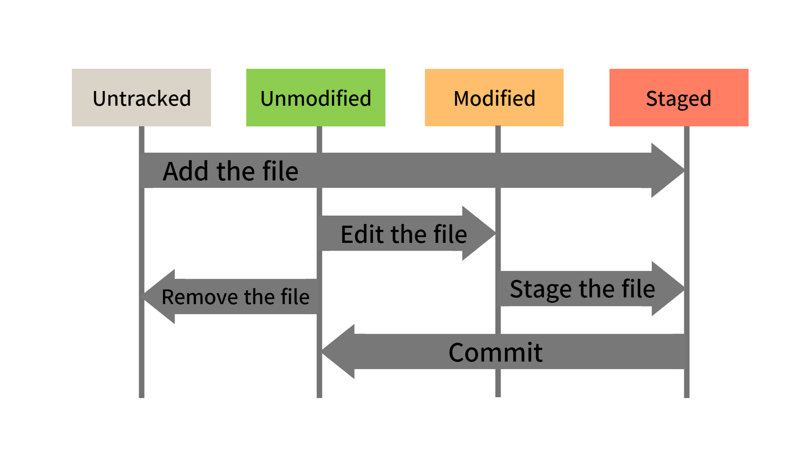

# Git 파일 상태 종류

Git에서 파일의 상태는 크게 4 가지로 나눌 수 있다.

 - Untracked (추적되지 않음)
 - Modified (수정됨)
 - Staged (스테이징됨)
 - Committed (커밋됨)

    

 

## Untracked(추적되지 않음)

Git이 아직 추적하지 않는 파일로 새로 생성된 파일이나 Git에 추가하지 않은 파일이 여기에 속한다.

 - git add 명령어를 통해 Untracked 파일을 Staging Area로 옮길 수 있다. Staged(스테이징됨) 상태로 변경된다.

## Staged(스테이징됨)

수정된 파일을 커밋할 준비가 된 상태로 이 상태의 파일은 Staging Area에 위치한다.

 - git commit 명령어를 통해 Repository에 변경 사항을 반영한다.

## Modified(수정됨)

Git이 이미 추적하고 있는 파일이 수정된 상태로 Staging Area에 반영되지 않은 상태이다.

 - Working Directory에서 파일이 수정된 상태로 존재한다.
 - git add 명령어를 통해 Modified 파일을 Staging Areea로 옮길 수 있다. Staged(스테이징됨) 상태로 변경된다.

## Committed(커밋됨) 혹은 Unmodified(수정되지 않음)

변경 사항이 로컬 Repository에 기록된 상태이다. 현재 파일의 내용이 최신 커밋의 모습과 비교했을 때 전혀 바뀐게 없는 상태이다.

