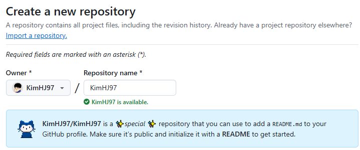
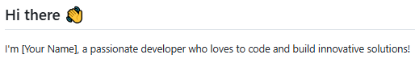
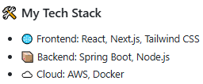
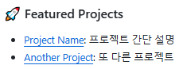
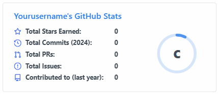
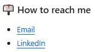
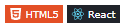
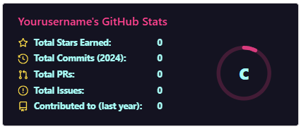
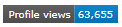
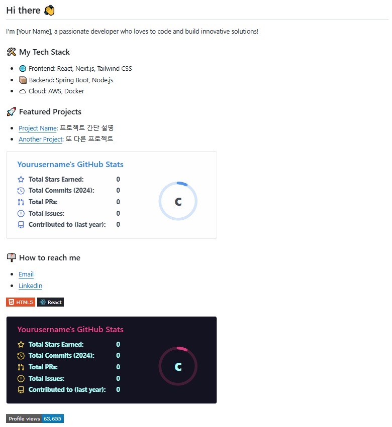

# Github Profile

## 1. Github Profile 꾸미기

Github는 프로필 README 기능을 제공하며, Markdown 파일을 작성하여 프로필 상단에 표시되는 커스터마이즈된  소개 페이지를 만들 수 있다.

 - 자신의 계정과 동일한 이름의 원격 저장소를 공개 저장소로 생성한다.
 - 생성된 저장소의 README.md 파일을 작성한다.
 - 프로필 예시
    - [Eddie Jaoude](https://github.com/eddiejaoude)
    - [Anurag Hazra](https://github.com/anuraghazra)

<div align="center">
    <br/>
    계정 이름이 KimHJ97 이라면 원격 저장소의 이름도 KimHJ97로 생성한다.
</div>
<br/>

### 1-1. README에 포함할 내용(예시)

 - __간단한 자기소개__
    - 이름, 직업, 기술 스택, 관심사 등
```md
## Hi there 👋
I'm [Your Name], a passionate developer who loves to code and build innovative solutions!
```
<div align="center">
    
</div>

 - __기술 스택__
    - 사용하는 프로그래밍 언어, 프레임워크, 도구 등을 아이콘으로 시각화
```md
### 🛠 My Tech Stack
- 🌐 Frontend: React, Next.js, Tailwind CSS
- 📦 Backend: Spring Boot, Node.js
- ☁️ Cloud: AWS, Docker
```
<div align="center">
    
</div>

 - __주요 프로젝트__
    - 자신이 자랑하고 싶은 프로젝트를 링크와 설명으로 정리
```md
### 🚀 Featured Projects
- [Project Name](https://github.com/yourusername/project-name): 프로젝트 간단 설명
- [Another Project](https://github.com/yourusername/another-project): 또 다른 프로젝트
```
<div align="center">
    
</div>

 - __Github 활동__
    - Github의 내장 뱃지 또는 오픈소스 기여 내역 표시
```md

```
<div align="center">
    
</div>

 - __연락처__
    - 이메일, LinkedIn, 개인 블로그 등을 연결
```md
### 📫 How to reach me
- [Email](mailto:your-email@example.com)
- [LinkedIn](https://linkedin.com/in/yourprofile)
```
<div align="center">
    
</div>

### 1-2. 시각적인 효과 부여

 - __GitHub Readme Badges 사용__
    - 기술 스택, 방문자 수 등을 보여주는 뱃지를 추가
    - 뱃지 생성 사이트: https://Shields.io/
    - 아이콘 생성 사이트: https://simpleicons.org/
        - 'https://img.shields.io/badge/{뱃지이름}-{CSS컬러}?style={스타일}&logo{로고}&logoColor={로고컬러}'
```md


```
<div align="center">
    
</div>

 - __GitHub Stats 추가__
    - GitHub 활동, 랭킹 등을 표시하는 카드
    - GitHub Readme Stats 사용
    - 공식 사이트: https://github.com/anuraghazra/github-readme-stats
```md

```
<div align="center">
    
</div>

 - __방문자 카운터__
    - 프로필 방문자를 표시
```md

```
<div align="center">
    
</div>

<div align="center">
    
</div>

 - __기술 스택 뱃지 예시__
```md
### 🛠 My Tech Stack
- 🌐 Frontend: 


- 📦 Backend: 


- 💾 Database: 


- 🛠 CI/CD: 


- ☁️ Infra/Cloud: 


| <a href="https://github.com/KimHJ97/github-readme-stats"></a> | <a href="https://github.com/KimHJ97/github-readme-stats"></a> |
| ------------- | ------------- |
```

### 1-3. 그 외 추가 작업

 - __Pinned Repositories 설정__
    - 자신이 자랑하고 싶은 저장소를 고정하여 프로필에 표시
    - GitHub 프로필에서 "Customize your pins" 클릭
 - __동적인 콘텐츠 추가 (Optional)__
    - Python이나 JavaScript로 동적 콘텐츠를 추가하는 스크립트를 작성해 재미있는 요소를 추가할 수 있다.
    - 예: 오늘의 날씨, 랜덤 코딩 팁 표시
