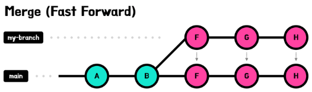

# Github Merge 방식

Github에서 제공하는 Merge 방식은 총 3가지로, Merge, Squash and Merge, Rebase and Merge가 있다.

## Merge

가장 기본적인 병합 방식으로, 병합되는 브랜치의 커밋 히스토리를 유지하면서 새로운 병합 커밋을 생성한다. 따라서 커밋 이력을 모두 남길 때 사용한다. 하지만, 두 브랜치의 변경 사항을 함꼐 포함하는 새로운 커밋이 생성되므로 커밋 히스토리가 복잡해질 수 있다.

 - __Fast-forward 방식__
    - 새로운 브랜치(my-branch)가 main 브랜치로부터 분기된 이후 main 브랜치에 새로운 커밋이 올라오지 않았다면, my-branch가 main과 비교하여 최신의 브랜치라고 할 수 있다.
    - 이런 경우 my-branch의 변경 이력을 그대로 main으로 가져올 수 있다.
    - 병합되는 브랜치가 다른 브랜치의 이력을 모두 포함하고 있는 경우에 사용된다.

    

 

 - __Recursive 방식__
    - 새로운 브랜치(my-branch)가 main 브랜치에서 분기되고, main 브랜치에 새로운 커밋이 생겼다면, my-branch를 최신으로 간주할 수 없다.
    - 따라서 my-branch와 main을 공통 부모로 한 새로운 Merge Commit을 생성하게 된다.
    - 두 브랜치가 서로 다른 이력을 가지고 있는 경우에 사용된다.
    - Fast-Forward Merge가 가능한 상태에서 git merge 명령에 --no-ff 옵션을 주면 강제로 Merge Commit을 생성하게 할 수 있다.

    

 

## Squash and Merge

Squash는 여러개의 커밋을 하나의 커밋으로 합치는 것을 의미한다. Squash Merge는 병합할 브랜치의 모든 커밋을 하나의 커밋으로 Squash(으깨다)한 새로운 커밋을 Base 브랜치에 추가하는 방식으로 병합하는 것을 의미한다.

이전의 커밋 히스토리를 간소화하여 깔끔하게 이력을 유지할 수 있으나, 단일 커밋으로 병합되기 때문에 브랜치 간의 변경 사항을 추적하기는 어렵다.

    

 

## Rebase and Merge

rebase는 Base를 다시 설정한다는 의미를 갖고 있다. Rebase를 수행하면 my-branch 가 분기된 main 브랜치의 최신 커밋을 Base로 설정한다.

커밋 히스토리가 선형적으로 유지되어 깔끔하고 읽기 쉬운 이력을 유지할 수 있다는 점은 장점이지만, 이전의 커밋들을 변경하기 때문에 다른 개발자들이 해당 브랜치를 사용 중이라면, 주의가 필요하다.

    

 

## 추천 방식

### feature 브랜치에서 develop 브랜치로 merge 하는 경우

Squash and Merge가 유리하다. feature 브랜치에서 기능을 개발하기 위해 사용된 지저분한 커밋 내역을 하나의 커밋으로 묶어 develop에 병합함으로써, develop에는 기능 단위로 커밋이 추가되도록 정리할 수 있다. 또한 feature 브랜치는 develop 브랜치에 병합 후 제거되므로, Merge Commit을 굳이 남길 필요가 없다.

### develop 브랜치에서 main 브랜치로 merge 하는 경우

Rebase and Merge가 유리하다. main 브랜치는 지금까지 작업한 모든 기능을 배포할 때 병합한다. develop 브랜치를 Squash and Merge 하게 되면 커밋 이력이 모두 사라져, 특정 기능에서 문제가 생겼을 때 롤백할 수 없게 된다. main 브랜치도 마찬가지로 Merge Commit은 남길 필요가 없다.

## 참고 블로그

 - https://velog.io/@gmlstjq123/Github-Merge-%EB%B0%A9%EC%8B%9D-%EC%9D%B4%ED%95%B4%ED%95%98%EA%B8%B0
